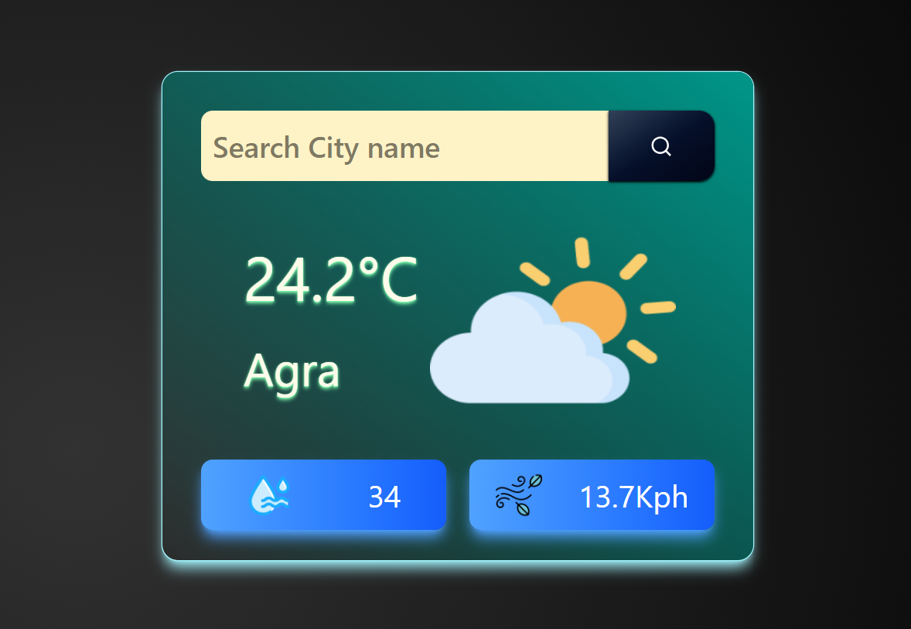
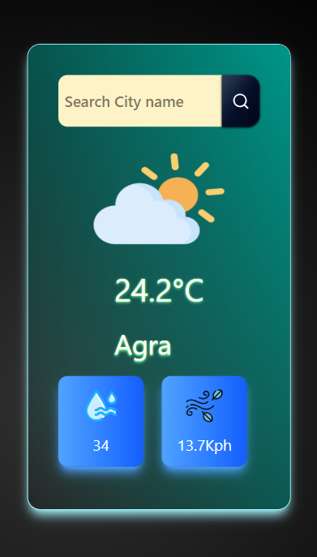

# 🌦️ Weather App (React)

A simple and modern **Weather Application** built using **React.js** that allows users to check real-time weather conditions of any city in the world.

---

## 🚀 Features

- 🔍 Search weather by city name
- 🌡️ Displays temperature, humidity, and wind speed
- 🌤️ Dynamic weather icons based on conditions
- 🎨 Clean and responsive UI
- ⚡ Fast and lightweight performance
- 🌍 Real-time data using Weather API

---

## 🌐 Live Demo

🚀 Try the app here:
👉https://weather-app-76q2.vercel.app/

---

## 🛠️ Tech Stack

- **Frontend:** React.js
- **Styling:** CSS / Tailwind CSS
- **API:** Weather API (e.g., OpenWeatherMap)
- **State Management:** React Hooks (`useState`, `useEffect`)

---

## 📂 Project Structure

```
src/
│
├── components/
│   └── Card.jsx
│
├── assets/
│   ├── humidity.png
│   ├── wind.png
│   └── weather-icons/
│
├── App.jsx
└── main.jsx
```

---

## ⚙️ Installation & Setup

1. Clone the repository:

```
git clone https://github.com/your-username/weather-app.git
```

2. Navigate to the project folder:

```
cd weather-app
```

3. Install dependencies:

```
npm install
```

4. Start the development server:

```
npm run dev
```

---

## 🔑 API Setup

- Get your API key from **OpenWeatherMap** (or any weather API).
- Replace the API key in your code:

```js
const apiKey = "YOUR_API_KEY";
```

---

## 📸 Screenshots

## 

## 

## 💡 Future Improvements

- 📍 Detect user location automatically
- 🌙 Dark mode toggle
- 📊 7-day weather forecast
- 🎨 Animated backgrounds based on weather
- 🔔 Weather alerts

---

## 🤝 Contributing

Contributions are welcome!
Feel free to fork this repo and submit a pull request.

---

## 📄 License

This project is open-source and available under the **MIT License**.

---

## 🙌 Acknowledgements

- Weather API providers
- React documentation

---

### ⭐ If you like this project, give it a star on GitHub!
